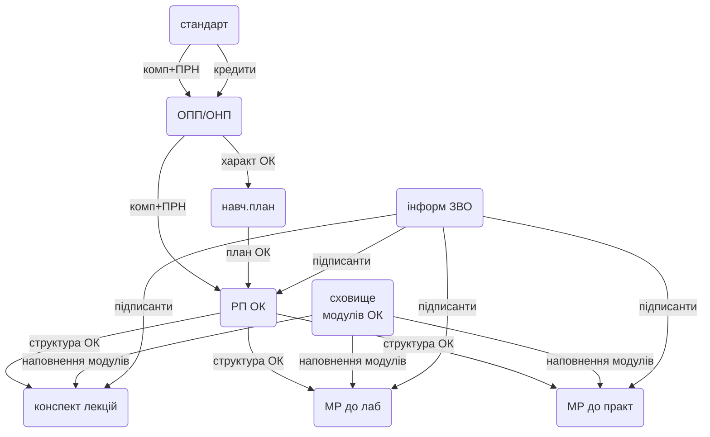

# Цифровізація методичного забезпечення НУХТ

https://github.com/pupenasan/nuftUedms

## Мета проекту

Мета проекту - переведення документів в дата-центричний (оснований на даних) електронний формат та створення внутрішньо-університетського стандарту представлення даних при обміні електронними документами між інформаційними системами університету задля автоматизації та інтенсифікації процесів створення, верифікації (формальної автоматичної перевірки), валідації (перевірки за зворотнім зв'язком), затвердження (підписання) документів та аналітичної обробки.   

Планується переведення в електронний дата-центричний формат з їх збереженням в БД та обміном між інформаційними системами університету наступних документів:

- стандарт вищої освіти на бакалавра/магістра/доктора філософії
- [освітня програма](OP.md) (**ОП**): ОПП/ОНП
- структура освітньої компоненти (**ОК**) або надалі робоча програма ОК (**РП**); призначена для формування наступних документів:
  - робоча програма освітньої компоненти 
  - силабус
- методичне забезпечення ОК:
  - текст лекцій
  - лабораторний практикум
  - практичних занять
  - вивчення дисципліни
  - курсової роботи
  - курсового проекту
  - кваліфікаційної роботи
  - проведення практики
- вкладені документи

## Терміни та скорочення

- ІС - інформаційні системи: програмне забезпечення для автоматизації різноманітних завдань; 
- БД - база даних: система пов'язаних файлів певного формату для збереження даних;
- СКБД - система керування базами даних: програмне забезпечення для керування БД;
- ОК - освітня компонента: дисципліна, курсові проекти/роботи, дипломні проекти/роботи, практики;  
- URI - уніфікований ідентифікатор ресурсу: посилання на ресурс
- API - Application Programm Interface: інтерфейс програмного забезпечення для обміну з іншим програмним забезпеченням за вказаними правилами; у даному випадку передбачається використання HTTP API (обмін з використанням протоколу HTTP) 

## Основні ідеї

- наведені в переліку вище документи є електронними записами в базах даних в текстових форматах, які  надають доступ до змістовних полів, що потребують ідентифікації, пошуку, оброблення; зокрема формати JSON, XML, HTML, MD (MarkDown), TXT   
- документи пов'язані між собою і з іншими даними та процесами, які вже автоматизовані в інформаційних системах; їх варто інтерпретувати як записи в базах даних, що дає можливість:
  - зменшити кількість помилок при створенні
  - експортувати дані в інші системи
  - робити аналітичні дослідження, так само як з будь якими даними
  - спростити порівняння версій (якщо використовувати системи керування версіями типу Git) а також простежувати прогрес змін
  - спростити сумісну роботу над документами
  - автоматизувати процеси верифікації (перевірку за формальними ознаками)
  - автоматизувати процеси отримання та збереження зворотного зв'язку від здобувачів
  - автоматизувати процеси розгортання, наприклад перенесення в Moodle або інші платформи
  - спростити затвердження (електронного підписання)
- документи в теперішньому вигляді (pdf, docx) у такому представленні будуть звітами, які можна друкувати у потрібному вигляді після усіх верифікацій та підписів
- дані можуть зберігатися в БД ІС в зручному для них вигляді

- рекомендована мова розмітки документів при передачі та збереженні:
  - JSON для документів що не потребують форматування для читання, тобто які представляють виключно дані
  - Markdown або HTML для збереження розділів книг, посібників, методичних рекомендацій, тощо 
  - SCORM на базі XML - якщо необхідно передавати дані в інші системи ; 

- обмін між ІС на базі HTTP API

## Основні компоненти

- **Електронний документ** надалі **документ** - це самодостатня сутність в електронному вигляді представлена у вигляді структурованих даних або форматованого тексту що в електронному вигляді зберігає текстовий вигляд (MD/HTML). Не варто їх плутати з документами типу pdf чи docx, які в даному контексті варто називати **звітним документом**.  Документ містить все, що необхідно для його перевірки, може мати посилання на пов'язані документи для витягування з нього даних та перевірки.   
- **Звітний документ** - паперова та/або електронна версія документу (наприклад скан-копія в pdf, або docx), який оформлений відповідно до вимог форми та змісту, та передбачає читання користувачем-людиною та нанесення на нього печатей та підписів.   
- **Верифікатор** - частина програми, або окремий сервіс, який проводить формальну перевірку відповідності документу заданим правилам:
  - на вхід верифікатору подається:
    - документ, або його частина, що потребує перевірки
    - правила верифікації у вигляді окремого документу або частини сервісу
  - якщо верифікатор передбачає користувацький інтерфейс, він вказує місце та причини помилок
  - на виході верифікатор може надавати через API змінений документ або його частину з примітками щодо валідності та пропозицій змін
- **ІС обробки документів**  - інформаційні система з WEB API, які забезпечує доступ до документів та до інших сервісів   

## Загальна концепція роботи з документами

Нижче наведена орієнтовна блок схема перетворення документів. 

## Інструменти та ІС

Для створення та редагування пропонується використовувати:

- Стандарт: окремий сервіс 
- ОПП/ОНП: окремий сервіс 
- робоча програма ОК:  [Moodle](ok_moodle.md)
- навчальний план: сервіс ПС (вже наявний)
- компоненти методичного забезпечення: 
  - MOODLE - книги MOODLE
  - редактори HTML - документи HTML
  - редактори Markdiwn (наприклад Typora) - документи MD
  - MS Word та аналогічні - тимчасово (треба дослідити) 
-   
