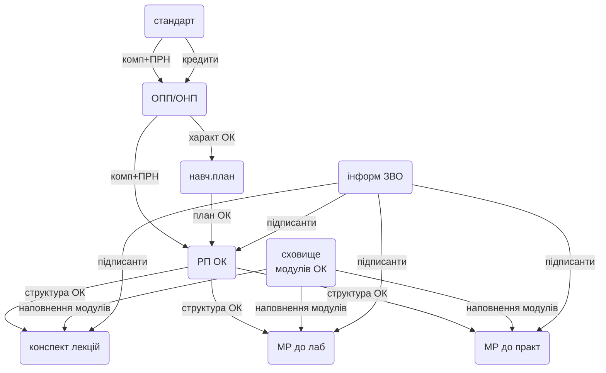

# Цифровізація методичного забезпечення НУХТ

https://github.com/pupenasan/nuftUedms

## Мета проекту

Мета проекту - переведення документів в дата-центричний електронний формат та створення внутрішньо-університетського стандарту представлення даних при обміні електронними документами між інформаційними системами університету задля автоматизації та інтенсифікації процесів створення, верифікації, валідації та аналітики документів.   

Переведення в електронний дата-центричний формат з їх збереженням в БД та обміном між інформаційними системами університету наступних документів:

- стандарт вищої освіти на бакалавра/магістра/доктора філософії
- [освітня програма](OP.md): ОП, ОНП
- освітня компонента для формування документів:
  - робоча програма освітньої компоненти
  - силабус
- методичне забезпечення ОК:
  - текст лекцій
  - лабораторний практикум
  - практичних занять
  - вивчення дисципліни
  - курсової роботи
  - курсового проекту
  - кваліфікаційної роботи
  - проведення практики
- вкладені документи

## Терміни та скорочення

- ІС - інформаційні системи
- БД - база даних
- СКБД - система керування базами даних
- ОК - освітня компонента 
- URI - уніфікований ідентифікатор ресурсу

## Основні ідеї

- самостійні структури наведені вище є документами (наприклад JSON, XML) або перетворюються в них з наявних в базі даних
- документи пов'язані між собою і з іншими даними та процесами, які вже автоматизовані в інформаційних системах тому вони повинні бути оцифровані до рівня даних, оскільки це дає можливість:
  - зменшити кількість помилок при створенні
  - витягувати дані в інші системи
  - робити аналітичні дослідження як з даними
  - спростити порівняння версій (якщо використовувати системи типу Git)
- документи в теперішньому вигляді (pdf, docx) - це звіти, вони друкуються після усіх верифікацій
- дані можуть зберігатися в БД ІС в зручному для них вигляді

- рекомендована мова розмітки документів при передачі та збереженні:
  - JSON для документів що не потребують форматування для читання, тобто які представляють виключно дані
  - Markdown або HTML для збереження розділів книг, посібників, методичних рекомендацій, тощо 
  - SCORM на базі XML - якщо необхідно передавати дані в інші системи ; 

- обмін між ІС на базі HTTP API

## Основні компоненти

- **Електронний документ** надалі **документ** - це самодостатня сутність в електронному вигляді як структура даних або текст, що форматований в форматі MD/HTML. Не варто їх плутати з документами типу pdf чи docx, в даному контексті ті варто називати **звітним документом**.  Документ містить все що необхідно для його перевірки, може мати посилання на пов'язані документи для витягування з нього даних та перевірки.   
- **Звітний документ** - паперова та/або електронна версія документу (наприклад скан копія в pdf), який оформлений відповідно до вимог форми та змісту, та передбачає читання користувачем-людиною та нанесення на нього печатей та підписів.   
- **Верифікатор** - частина програми, або окремий сервіс, який проводить перевірку відповідності документу заданим правилам:
  - на вхід верифікатору подається:
    - документ, або його частина, що потребує перевірки
    - правила верифікації у вигляді окремого документу або частини сервісу
  - якщо верифікатор передбачає користувацький інтерфейс, він вказує місце та причини помилок
  - на виході верифікатор може надавати через API змінений документ або його частину з примітками щодо валідності та пропозицій змін
- **ІС обробки документів**  - інформаційні система з WEB API, які забезпечує доступ до документів та до інших сервісів   

## Загальна концепція роботи з документами

