[На головну](README.md)

# Створення робочої програми ОК за допомогою Moodle

У даному способі передбачається що для створення робочих програм та наповнення освітніх компонент використовується платформа Moodle. Для цього рекомендується використовувати окремий екземпляр Moodle, з яким не працюють здобувачі. Після завершення створення та наповнення освітньої компоненти, її можна буде експортувати в Moodle систему `cde.nuft.edu.ua`.   

## Створення курсу

Кожна освітня компонента відповідає окремому курсу Moodle. Курс створюється (але не наповнюється) менеджером системи Moodle:

- на перший етапах впровадження це відбуватиметься вручну, тому менеджерами мають бути усі гаранти освітніх програм;
- після впровадження електронних варіантів ОПП/ОНП, створення курсів відбуватиметься автоматизовано скриптом відповідно до змісту ОПП/ОНП;

При створенні курсу менеджер (а після впровадження електронних варіантів ОПП/ОНП скрипт) задає:

- повна та коротка назва курсу, яка має бути унікальною (правила найменування треба узгодити) 
- інші поля, аналогічно як при створенні курсів в `cde` 
- компетентності (див пункт "Компетентності" нижче)
- вся необхідна інформація з освітньої програми та підписантів
  - при ручному створенні у вигляді таблиці
  - при автоматичному таблиця генеруватиметься автоматично  

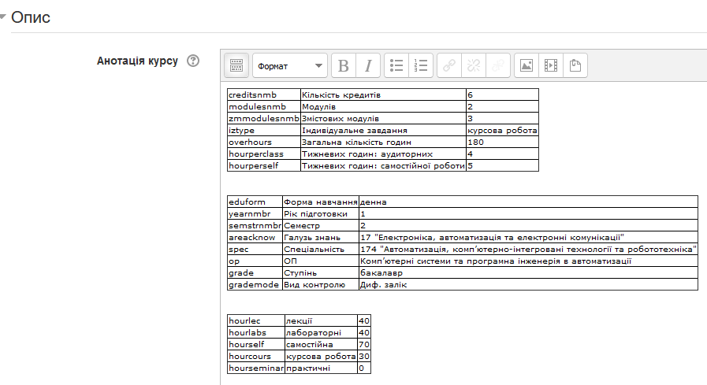

## Створення структури курсу 

Створення структури курсу передбачає створення різних ресурсів/діяльностей Moodle, без їх наповнення. За структурою курсу можна згенерувати робочу програму. За готовим наповненим курсом також можна згенерувати робочу програму. Тому робоча програма в даному випадку є генерованим документом, а курс є первинним. Якщо робоча програма в електронному вигляді буде записана в базі даних і затверджена, то:

- за нею можна буде генерувати готові структури курсу
- можна буде звіряти структуру існуючого курсу зі збереженою

Правила створення структури курсу може обговорюватися. Описані нижче підходи використаня наразі у прототипі. 

### Загальна частина

У загальні частині можна розміщувати будь яку інформацію. Але для структури важливо щоб там містилися ті частини, які мають бути в конкретних розділах робочої програми і не є частиною інших розділів. Наприклад:

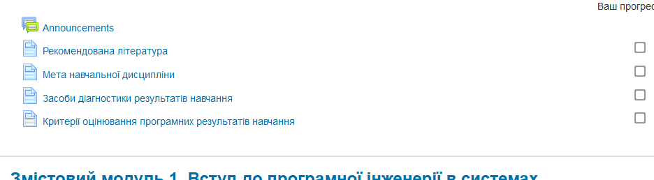

У найпростішому випадку ця інформація буде у форматі HTML сторінок, яка автоматично перенесеться у звітну робочу програму. Наприклад:

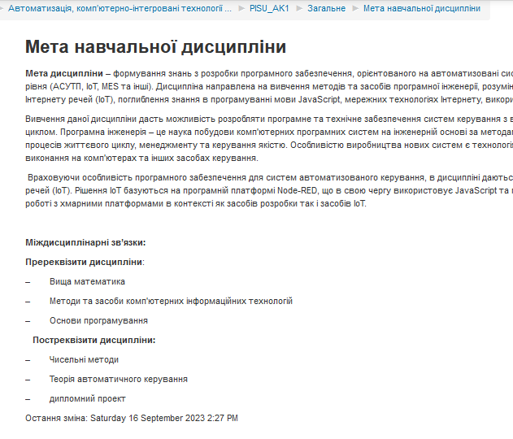

За можливості цифрового представлення цих даних у вигляді окремих сутностей, інформація може зберігатися в описі ресурсів Moodle, наприклад:

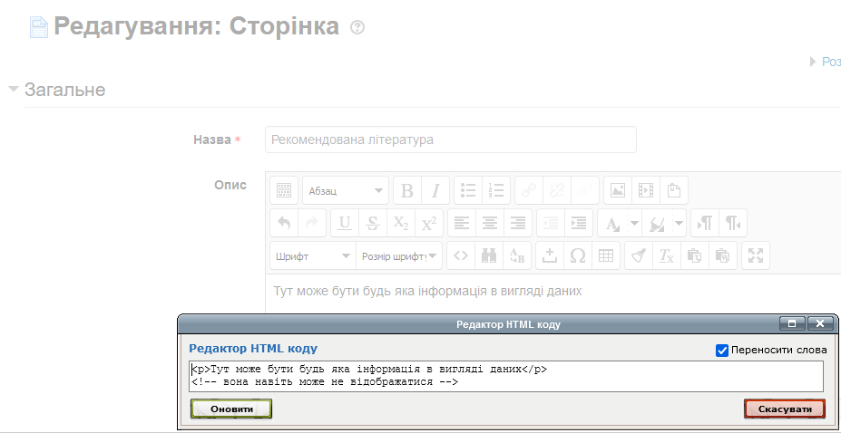

### Змістові модулі

Освітня програма передбачає розділення на змістові модулі. Змістові модулі в даній редакції прототипу - це пусті розділи (тобто не мають ніяких діяльностей чи ресурсів), які починаються зі слова "Зміст". Можна буде перевизначити дані правила. Послідовність розміщення змістових модулів має співпадати з порядком в робочій програмі.

### Теми

Теми виділяються як окремі розділи курсу Moodle. В межах цих тем створюються необхідні елементи.

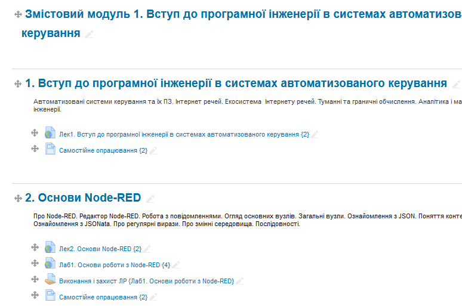

### Елементи змістового модулю

Елементи змістового модулю записуються в межах тем у вигляді будь яких з ресурсів Moodle. 

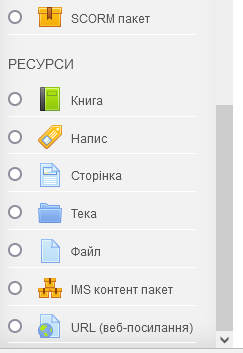

Наразі тип елементу визначається за назвою:

- Лаб
- Лек
- Прак
- Сам

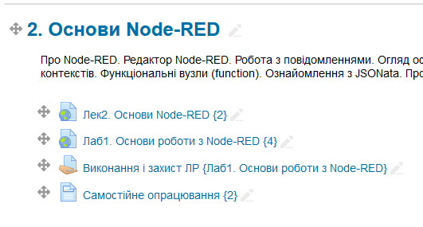

У назві кожної діяльності у фігурних дужках вказана кількість годин, наприклад `Лек2. Основи Node-RED {2}` вказує на те, що на цю лекцію виділено 2 години. 

Зверніть увагу, що самостійна робота виділена як окремий ресурс. 

Для структурування дисципліни наповнення ресурсу немає значення. Однак він буде використовуватися при автоматизованому створенні методичного  забезпечення.

### Оцінювальні діяльності

Оцінювальні діяльності в даному прототипі реалізовано через "Завдання", однак те саме можна зробити і через "Тест". У даному прототипі назва діяльності складається з двох частин:

- Форма контролю, наприклад "Виконання і захист ЛР"
- Елементи змістового модуля, що перевіряється, який задається у фігурних дужках, наприклад   `{Лаб1. Основи роботи з Node-RED}` 

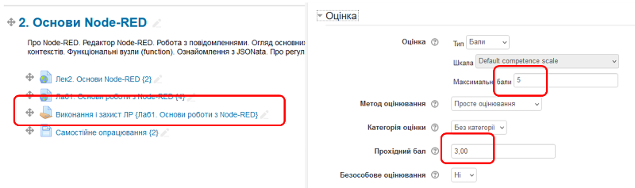

У налаштуванні діяльності вказується мінімальна та максимальна кількість балів за даний елемент змістового модулю.

### Керування компетентностями

До створення всіх курсів в системі Moodle для кожної освітньої програми кожного року мають бути створені репозиторії компетентностей. На стадії автоматизованого створення ОПП/ОНП вони будуть створюватися автоматизовано за ініціативи гаранта ОП. 

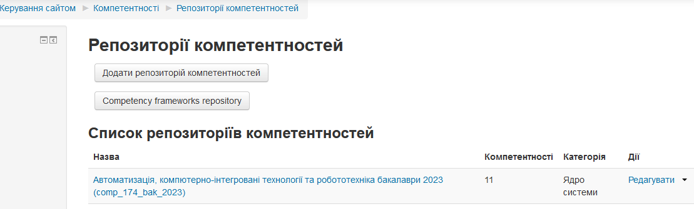

Репозиторії містять компетентості та ПРН.

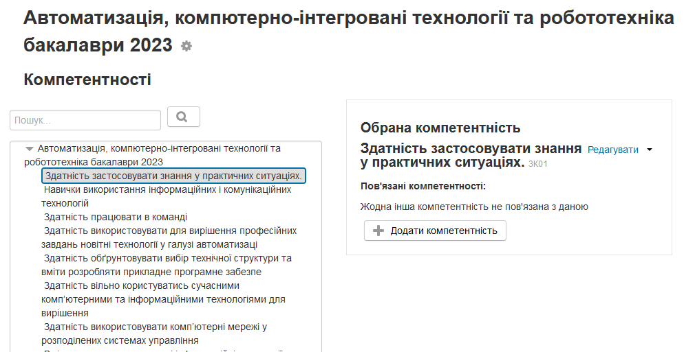

У налаштуваннях компетентностей задається ID.

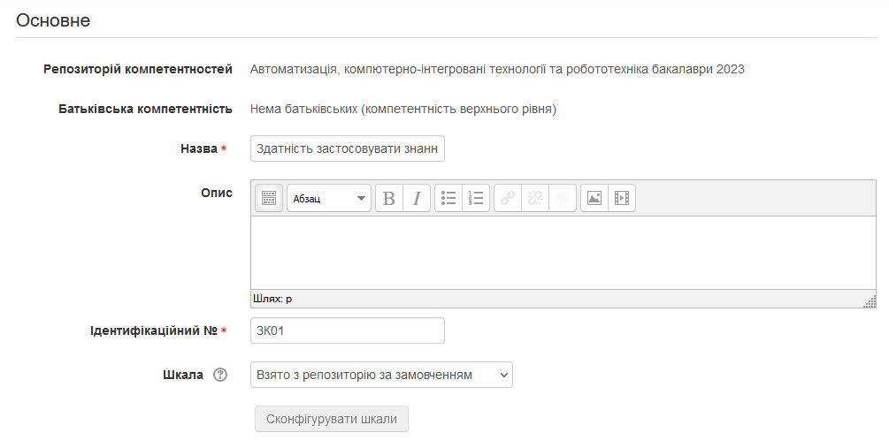

Компетентності додаються в курсі у відповідному розділі

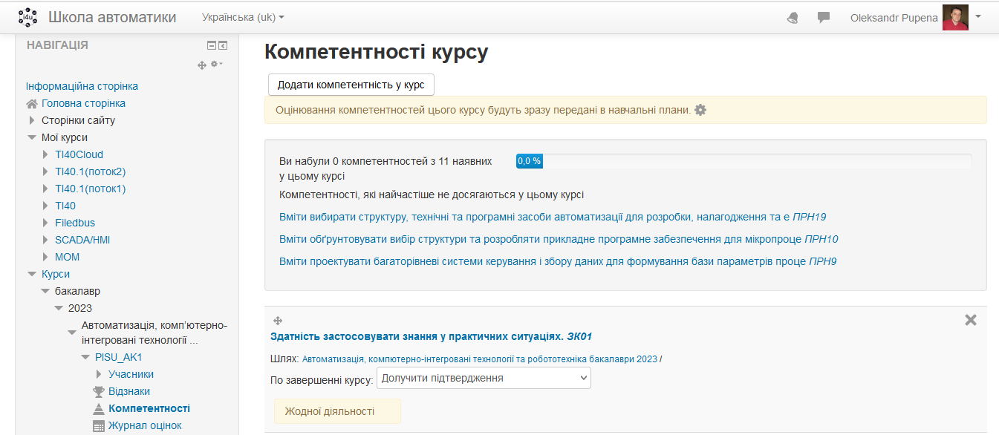

Компетеності Moodle можна використовувати для автоматизації оцінювання степені набутих ПРН за оцінюванням. Однак наразі це не використовується.

## Перевірка робочої програми

Описані вище дії робляться для означення структури курсу. Для верифікації (перевірки за формальними ознаками) структури курсу можна використовувати:

- пеціальний модуль Moodle, який необхідно розробити 
- або сторонній сервіс через REST API, який необхідно розробити. 

Нижче наведений опис прототипу, який створено виключно для демонстрації можливостей. Вигляд і функціонал буде змінено за вибору даного шляху реалізації. У даному прототипі використовується сторонній самостійно розроблений сервіс на базі рішення [Appsmith](https://www.appsmith.com/), який на перших стадіях впровадження (MVP) можна створювати власними силами для визначення необхідного функціоналу. Наразі використовується безкоштовна версія Appsmith.

### Вимоги до Moodle

Система Moodle повинна бути налаштована адміністратором системи:

- для доступу з використанням REST
- для надання доступу користувачів до необхідного функціоналу необхідно налаштувати ролі та надати їх користувачам

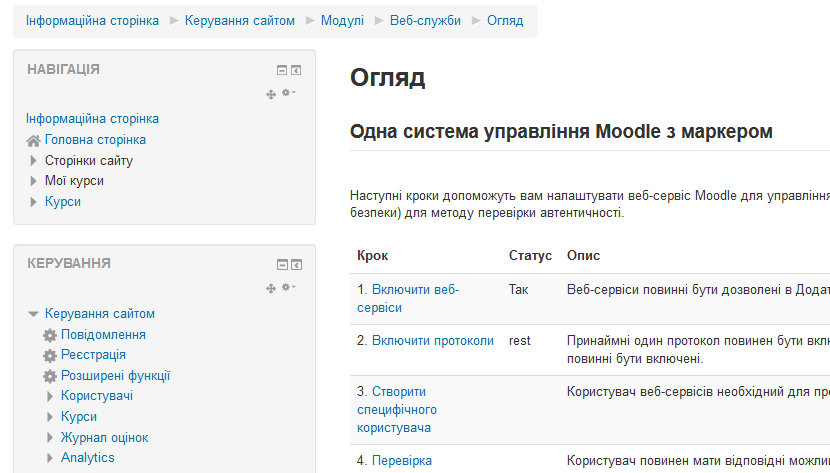

Користувач (автор курсу, менеджер) заходить в систему під своїм обліковим записом Moodle:

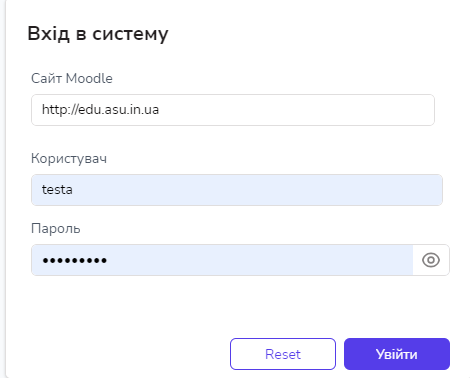    

Далі користувач отримує список курсів, які йому доступні. Вибравши курс зі списку можна подивитися його опис. 

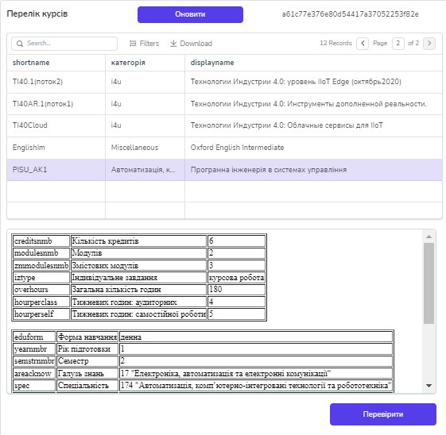

Натиснувши "Перевірити" можна перейти на сторінку формальної верифікації. На ній наразі відображається:

- уся інформація про структуру курсу з вказівкою дизбалансів 

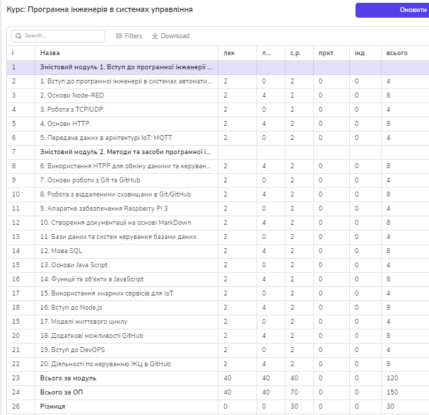 

- контроль та оцінювання результатів навчання

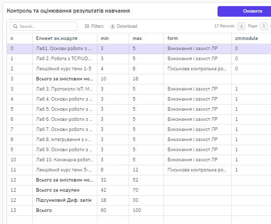

- можна відображати і іншу інформацію, зокрема

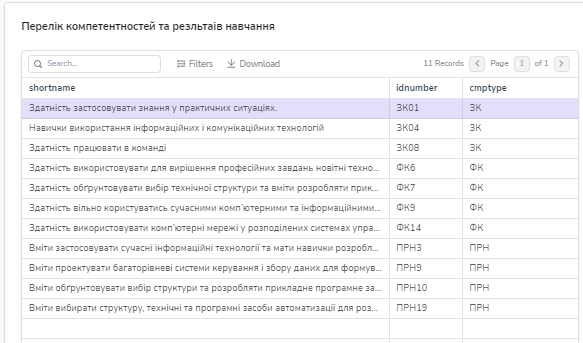

- 

## Альтернативні доповнення

Для кращої керованості, варто б було між Appsmith та Moodle запустити окремий сервіс, який може також автоматизувати інші завдання.